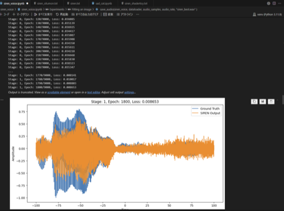
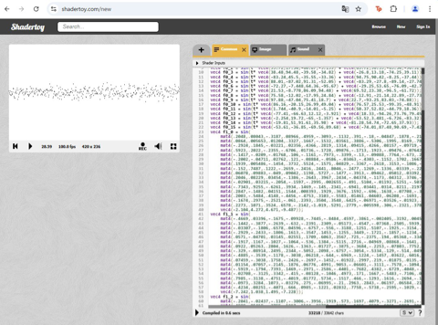

[日本語にする ](https://github-com.translate.goog/tyapa0/SIREN_VOICE?_x_tr_sl=en&_x_tr_tl=ja&_x_tr_hl=ja&_x_tr_pto=wapp) 

# SIREN_VOICE
Waveform learning using the SIREN algorithm and shader code output.
This is a toolset for learning prepared waveforms using the SIREN algorithm and outputting the waveforms as shaders.

## Learn waveforms on vscode.  
  


## Play it on shadertoy.  
  


# Description
* requirements.txt  
This file lists the required libraries.

* siren_voice.snd.glsl  
This is a completed data sample prepared as a music shader for minimal_gl.

* siren_voice_mod.ipynb  
This is a python code using the SIREN algorithm. It is recommended to run it in vs code, a Jupyter notebook-specific file.

# Installation
※This is how to build it on Windows.
All done on the command line.

First, git clone. Next, create the environment with venv.
```
git clone https://github.com/tyapa0/SIREN_VOICE.git
python -m venv venv
```
Next, activate the venv, install pytourch, and then include all the libraries using requirements.txt.

```
.\venv\Scripts\activate
pip install torch==2.3.1 torchvision==0.18.1 torchaudio==2.3.1 --index-url https://download.pytorch.org/whl/cu121
pip install -r requirements.txt
```
Read siren_voice_mod.ipynb into vscode. It is recommended that you have the Jupyter add-on installed. Phython must already be in the environment to run it.
Run the appropriate Phython from vscode.


# HowTo
This GPU is required to train with Jupyter Notebook.  
If you are using a PC without a GPU, you will need to delete "siren.cuda()" from the code, so it is best to run it on a PC with a GPU.
The following code in Jupyter Notebook is the part you will edit most often.
The arguments are (from left to right): dataloader, hidden_features, hidden_layers, omega, epochs.

```
siren_voice = train_siren(dataloader, 28, 1, 20, 1000000) 
```

* hidden_features: 
This number determines the size of the data. SIREN uses large numbers such as 256 and 128, but we try to keep the value to the lowest possible value in order to keep it under 4kb.

* hidden_layers: The optimum value is between 1 and 3. Anything above that will cause the data to become too bloated to be executed by the shader.

* omega: The pitch of the noise changes. At 10, low frequency noise is added to the data, and at 100, higher frequency noise is added to the data. Adjust the value to a level that is easy to hear depending on the data conditions.

* epochs: This is the value for how long to calculate. Start with 100 or 200 and observe the convergence. When you want to obtain the final data, set it to a larger value. This affects the time it takes to complete the calculation.
#
The following are important points when running with shader toys.
The value of baseFreq is 200, which means the value at 1 second.
```
float additiveWave(float amp, float baseFreq, float t) {
    float st = mod(t * baseFreq, 200.0) - 100.0;
    return (siren_sound(st) / 1.07) * amp;
}
```
If the training data is only 0.654 seconds long, you need to divide it by 0.654.
```
    float st = mod(t * baseFreq / 0.654, 200.0) - 100.0;
```


# link
This is a tool to convert it into an exe.  
read to **siren_voice.snd.glsl**  
https://github.com/yosshin4004/minimal_gl

The original SIREN algorithm and Jupyter note are here.  
https://github.com/vsitzmann/siren

Good Luck.